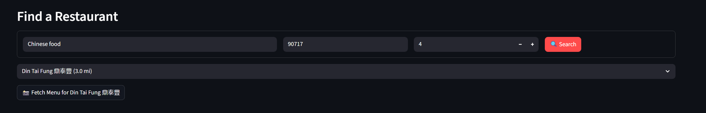
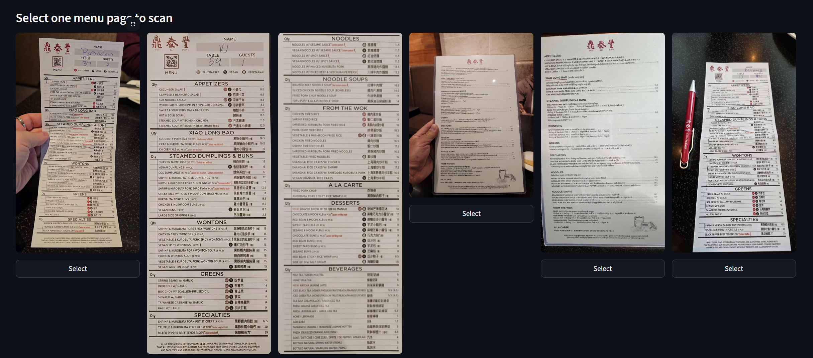
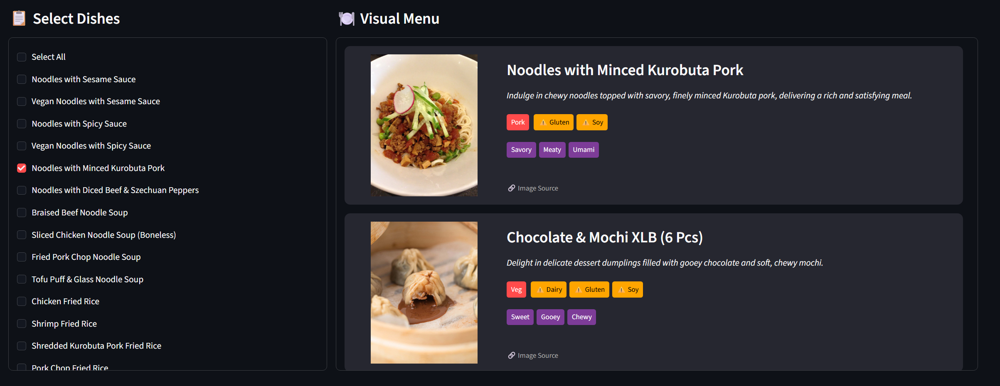

# Menu Lens 🍔

Menu Lens is an AI-powered tool that transforms restaurant menu images into info rich images of your order. Effortlessly upload photos or search for restaurants, and Menu Lens will extract dish names, generate realistic images for menus which otherwise feel like reading a textbook at a dining table! 

Menu Lens highlight key details like allergens and taste profiles - so that you know what you're exactly going to order!

---
## Screenshots & Demo

[Demo Video](data/videos/demo.mp4)

## Project Overview

Menu Lens is a Streamlit app that analyzes restaurant menu images and generates a visual menu with dish photos, descriptions, and allergen/taste tags. It supports manual menu uploads and Google Maps-powered restaurant search.

---

## Features
- Upload menu images and extract dish information
- Search for restaurants via Google Maps and fetch menu photos
- Visualize dishes with AI-generated images, taste tags, and allergen info
- Modular codebase for easy maintenance

---

## Setup

1. **Clone the repository**
2. **Install dependencies**
   ```bash
   pip install -r requierments.txt
   ```
3. **Add your API keys**
   - Create a `.env` file in the project root with:
     ```env
     GOOGLE_API_KEY=your_google_api_key
     TAVILY_API_KEY=your_tavily_api_key
     SERPAPI_API_KEY=your_serpapi_api_key
     ```
4. **Run the app**
   ```bash
   streamlit run main.py
   ```

---

## Usage

### Manual Upload
- Go to the "📸 Manual Upload" tab
- Upload a menu image
- Click "Ask Chef" to extract dishes
- Select dishes and visualize them

### Google Maps Search
- Go to the "🔍 Search Google Maps" tab
- Enter restaurant name, zip, and radius
- Select a location and fetch menu photos
- Choose a menu page and analyze dishes

---

## Code Structure

- `main.py`: Entry point
- `config.py`: API keys and client setup
- `helpers.py`: Geolocation, search, image loading
- `analysis.py`: Menu analysis and dish rendering
- `ui.py`: Streamlit UI and workflow
- `data/images/`: Store menu and dish images
- `data/videos/`: Store demo/tutorial videos

---

## Tech Stack 
Frontend: Streamlit (Python)
Intelligence (VLM): Google Gemini 2.5 Flash (chosen for low latency & high OCR accuracy).
Location Data: SerpApi (Google Maps Integration).
Visual Retrieval: Tavily AI (Context-aware image search).
Optimization: concurrent.futures for parallel processing, Pillow for image optimization.

---

## Key challenges 

### 1. The "Hallucination" Problem vs. Realism
* **Challenge:** The initial architecture evaluated Generative AI models (like Dall-E 3) for visualizing dishes. However, testing revealed that these models produced "hallucinated" or idealized images that did not match the restaurant's actual style (e.g., a diner burger appearing as a Michelin-star plate), which degraded user trust.
* **Solution:** The architecture pivoted to a **Retrieval-Based** approach. Instead of generating synthetic images, the system uses **Tavily's Search API** to locate *existing* photos of specific dishes from food blogs and reviews.
* **Result:** The application provides a "truthful" visual preview based on real-world data, significantly increasing utility for dining decisions compared to generative alternatives.

### 2. Intelligent Filtering (Signal-to-Noise Ratio)
* **Challenge:** Raw photo streams from Google Maps (via SerpApi) contain significant noise, including storefronts, selfies, and blurry non-food images. Manually sifting through this unstructured data to find a legible menu page created poor UX.
* **Solution:** A **Text-Density Filter** was engineered using the Gemini VLM. Before displaying images to the user, the system samples candidates and scores them based on "visible text content."
* **Result:** The system automatically discards non-menu images, presenting the user only with high-confidence menu pages and reducing navigation friction by approximately 80%.

### 3. Latency Optimization (The "Lazy" Approach)
* **Challenge:** The application initially suffered from 5-8 second startup times due to the blocking import of heavy libraries (`google.generativeai`, `geopy`, `PIL`) at the global scope.
* **Solution:** **Lazy Loading** and **Resource Caching** patterns were implemented to optimize the critical rendering path:
    1.  **Lazy Imports:** Heavy libraries are imported only within the specific scope functions that require them, unblocking the initial UI render.
    2.  **`@st.cache_resource`:** API clients (Tavily, Gemini) are initialized once and cached in memory, preventing expensive re-authentication on every user interaction.
    3.  **Image Downsampling:** Menu photos are resized to `800px` before VLM processing, reducing token count by ~40% without sacrificing OCR legibility.
* **Result:** Application launch time dropped from ~6s to <1s, and the "Read Menu" processing pipeline was accelerated by ~40%.

## Screenshots

<!-- Upload screenshots to data/images/ and reference them below -->





---

## Contributing

1. Fork the repo
2. Create a feature branch
3. Submit a pull request

---

## License

MIT License

---

## Contact

For questions or feedback, open an issue or contact the maintainer.
